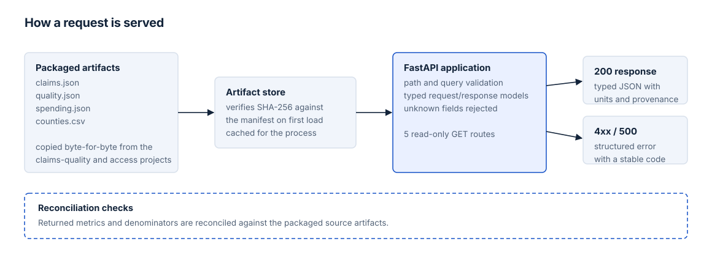

# Healthcare Analytics API

A read-only FastAPI service that serves results from the claims-quality and primary-care-access analyses, so other applications can use them without reading each project's files. Responses are typed, inputs are validated, and tests check every returned value against the source files.

## Endpoints

| GET endpoint | Returns |
|---|---|
| `/health` | Service status and a check that the packaged data loaded correctly |
| `/quality/summary` | Defect-evaluation results by category from the synthetic claims analysis |
| `/spending/summary` | Baseline spending and utilization, with the join-error comparison |
| `/access/counties` | All 14 Massachusetts counties, sorted by FIPS |
| `/access/counties/{county_fips}` | One county |

Analytical responses carry units, source period, basis and the relevant denominator. Money is in integer USD cents except the labeled per-member-month rate, and `null` means unavailable, not zero. See the [metric definitions](docs/METRICS.md).

## How it works



The API serves a fixed set of result files from the claims-quality and primary-care access projects. It does not use a database or recalculate the analyses.

The county endpoint supports an optional `selection` filter. Invalid requests return consistent JSON errors; full request and error behavior is documented in [contracts and errors](docs/CONTRACTS.md). Swagger documentation is available locally at `/docs`.

## Example

```sh
curl http://127.0.0.1:8000/access/counties/25011
```

```json
{
  "provenance": {
    "project": "ma-primary-care-access",
    "project_version": "0.1.0",
    "commit": "67bd860b69ac33384dd238647c83169d250f8d5b",
    "artifact_version": "1",
    "source_period": "ACS 2019-2023; physician counts 2023",
    "limitation": "County screening indicators do not establish unmet need or an optimal clinic location."
  },
  "county": {
    "county_fips": "25011",
    "county": "Franklin",
    "baseline_selected": true,
    "capacity_stable": true,
    "metrics": [
      {
        "name": "population",
        "value": 70922.0,
        "unit": "people",
        "basis": "ACS total population",
        "denominator": null,
        "source_period": "ACS 2019-2023"
      }
    ]
  }
}
```

A county that is not in the dataset returns `404`:

```sh
curl http://127.0.0.1:8000/access/counties/99999
```

```json
{ "error": { "code": "resource_unavailable", "message": "County is unavailable in this dataset." } }
```

Only one metric is shown above; the full response lists them all. More recorded requests and responses are in [`docs/examples.json`](docs/examples.json).

## Testing

Tests compare returned values with the source files and cover response shapes, input validation and error handling. See [validation](docs/VERIFICATION.md) and [provenance](docs/PROVENANCE.md).

## Source projects

- **[Healthcare Claims Quality & Financial Reconciliation](https://github.com/yashwanth-kanajam/healthcare-claims-quality)**: `claims.json`, `quality.json` and `spending.json`
- **[Massachusetts Primary Care Access Planning](https://github.com/yashwanth-kanajam/ma-primary-care-access)**: `counties.csv`

## Run locally

Requires Python 3.11+.

```sh
python3 -m venv .venv
.venv/bin/python -m pip install -r requirements-lock.txt
.venv/bin/python -m pip install --no-deps .
.venv/bin/python -m uvicorn healthcare_api.app:app --host 127.0.0.1 --port 8000
```

Then open [Swagger UI](http://127.0.0.1:8000/docs) or the [OpenAPI JSON](http://127.0.0.1:8000/openapi.json). There is no authentication, so the service runs on localhost only.

```sh
curl http://127.0.0.1:8000/health
curl http://127.0.0.1:8000/quality/summary
curl http://127.0.0.1:8000/spending/summary
curl 'http://127.0.0.1:8000/access/counties?selection=baseline'
.venv/bin/python -m pytest -q
```

## Limitations

The API serves fixed outputs from the two analysis projects and is a local demonstration, not a production service. The claims data are synthetic and the county data are historical public aggregates. Analytical limitations are those of the source projects.
